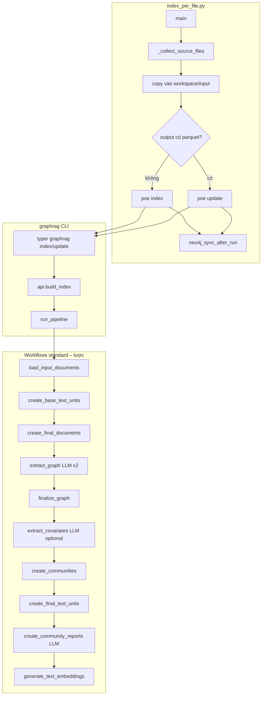

L**uồng thực tế** khi chạy lệnh (mặc định `--method standard`, không `--dry-run`), dựa trên `scripts/index_per_file.py` và pipeline GraphRAG.

## 1. Lớp ngoài: `scripts/index_per_file.py`

1. `**parse_args()`** – đọc `--source-dir`, `--pattern`, `--workspace-root`, v.v.
2. `**main()**`
  - `**ensure_paths()**` – kiểm tra `repo_root`, `workspace_root`, `source_dir`; tạo `workspace/input/` nếu cần.
  - `**_collect_source_files(source_dir, pattern)**` – chỉ lấy file `.txt`/`.doc`/`.docx` khớp pattern; trường hợp của bạn: một file `**NĐ_12-2022_NĐ-CP.txt**` (nếu có trong thư mục).
  - **Neo4j (tuỳ chọn):** có password → `**neo4j_connect`**, `**neo4j_setup_constraints**`; không có thì parquet-only.
3. **Vòng lặp mỗi file**
  - Xóa file trong `**workspace/input/`**.
  - `**_convert_to_txt()**` – với `.txt` chỉ trả đường dẫn gốc; không gọi LibreOffice.
  - `**shutil.copy2**` → copy vào `**{workspace_root}/input/<tên>.txt**`.
  - Quyết định lệnh graphrag:

```527:534:scripts/index_per_file.py
        has_existing_output = output_dir.exists() and any(output_dir.glob("*.parquet"))
        # Existing index result (even new run) → update; no output → first index
        command_name = "update" if has_existing_output else "index"
        command = [
            "uv",
            "run",
            "poe",
            command_name,
```

- `**run_command()**` trong `cwd=repo_root` → thực chất là `**python -m graphrag index**` hoặc `**update**` (xem `pyproject.toml`).
- Nếu bật Neo4j và thành công: `**neo4j_sync_after_run()**` → đọc `output/*.parquet`, `**neo4j_sync_dir()**` (`MERGE` Document, TextUnit, Entity, Community, CommunityReport; cạnh `**RELATED_TO**`).

Không có class “pipeline” trong script này; script chỉ **chuẩn bị input**, **spawn subprocess**, rồi **sync Neo4j**.

---

## 2. Subprocess GraphRAG CLI

Typer `**graphrag.cli.main.app`** (`python -m graphrag`):

- `**_index_cli` / `_update_cli**` → `**graphrag.cli.index.index_cli**` hoặc `**update_cli**`.

Đó gọi:

- `**load_config(root_dir)**` – đọc `settings.yaml` + model/prompt của workspace (đường dẫn prompt thường trỏ tới file trong `prompts/` của workspace).

Sau đó:

- `**graphrag.api.index.build_index**` với `**method**` = `"standard"` **hoặc** `"standard-update"` (khi chạy `update`):

```124:131:packages/graphrag/graphrag/cli/index.py
    outputs = asyncio.run(
        api.build_index(
            config=config,
            method=method,
            is_update_run=is_update_run,
            callbacks=[ConsoleWorkflowCallbacks(verbose=verbose)],
            verbose=verbose,
        )
```

Trong `**build_index**`:

- `**PipelineFactory.create_pipeline**` – nếu `config.workflows` không ghi đè thì pipeline mặc định nằm trong `**factory.py**` (chuỗi tên workflow).
- `**run_pipeline**` (`**graphrag.index.run.run_pipeline**`) → tạo storage/cache/table_provider → `**_run_pipeline**`: **lần lượt** `await workflow_function(config, context)` cho từng workflow.

---

## 3. Pipeline `standard` (lần index đầu: `has_existing_output == False`)

Thứ tự workflow đăng ký:

```52:61:packages/graphrag/graphrag/index/workflows/factory.py
_standard_workflows = [
    "create_base_text_units",
    "create_final_documents",
    "extract_graph",
    "finalize_graph",
    "extract_covariates",
    "create_communities",
    "create_final_text_units",
    "create_community_reports",
    "generate_text_embeddings",
]
...
PipelineFactory.register_pipeline(
    IndexingMethod.Standard, ["load_input_documents", *_standard_workflows]
)
```

### Các workflow → hàm / module chính


| Workflow                       | Entry                                                                                                   | Ý chính                                                                                                                                                     | LLM                                             |
| ------------------------------ | ------------------------------------------------------------------------------------------------------- | ----------------------------------------------------------------------------------------------------------------------------------------------------------- | ----------------------------------------------- |
| `load_input_documents`         | `run_workflow` trong `load_input_documents.py` → `**load_input_documents()**`                           | `create_input_reader` + stream doc → parquet `**documents**`                                                                                                | Không                                           |
| `create_base_text_units`       | `create_base_text_units.py`                                                                             | Chunk theo config → `**text_units**`                                                                                                                        | Không                                           |
| `create_final_documents`       | `create_final_documents.py`                                                                             | Chuẩn hóa/join `**documents**` với `**text_units**`                                                                                                         | Không                                           |
| `**extract_graph**`            | `extract_graph.run_workflow`                                                                            | `**create_completion**` (extract) + `**create_completion**` (summarize) → `**index.operations.extract_graph.extract_graph**` + `**summarize_descriptions**` | **Có** – 2 completion: trích đồ thị + gộp mô tả |
| `finalize_graph`               | `finalize_graph.run_workflow` → `**finalize_graph()`** → `finalize_entities` / `finalize_relationships` | `degree`, uuid, parquet entities/relationships                                                                                                              | Không                                           |
| `extract_covariates`           | `extract_covariates.run_workflow`                                                                       | Chỉ chạy nếu `**config.extract_claims.enabled**` → `**extract_covariates**` operation                                                                       | **Có** – completion “claims”                    |
| `create_communities`           | `create_communities.py` → `**cluster_graph`** (Leiden, graph từ relationships)                          | `**communities**`                                                                                                                                           | Không                                           |
| `create_final_text_units`      | `create_final_text_units.py`                                                                            | Bổ sung text unit cuối                                                                                                                                      | Không                                           |
| `**create_community_reports**` | `create_community_reports.run_workflow` → `**summarize_communities**` với `**prompts.graph_prompt**`    | `**community_reports**`                                                                                                                                     | **Có** – completion báo cáo cộng đồng           |
| `**generate_text_embeddings`** | `generate_text_embeddings.run_workflow` → `**create_embedding**` + `**embed_text**`                     | Embedding cho text units / entities / community reports                                                                                                     | **Embedding API** (không phải chat completion)  |


### Chùm extract graph – class / function lõi

- `**extract_graph` (workflow)** gọi:
  - `**graphrag_llm.completion.create_completion`** hai lần: `completion_model_id` từ `**config.extract_graph**` và `**config.summarize_descriptions**`.
  - `**index.operations.extract_graph.extract_graph.extract_graph**` → `**GraphExtractor**` (`graph_extractor.py`): `**completion_async**` với prompt trích entity/relationship (+ `**CONTINUE_PROMPT**` / `**LOOP_PROMPT**` nếu `max_gleanings > 0`).
  - `**summarize_descriptions**` (`**operations/summarize_descriptions**`): gộp các mô tả trùng entity/cạnh bằng LLM.

---

## 4. Pipeline `standard-update` (khi trong `workspace/output/` đã có `.parquet`)

`index_per_file` gọi `poe update` → `**is_update_run=True**` → trong API method thành `**standard-update**`:

Workflow list (đăng ký trong `factory`): `**load_update_documents**` + **cùng bộ `_standard_workflows`** + `**_update_workflows**` (`update_final_documents`, `update_entities_relationships`, …). Ý nghĩa: **đọc delta**, chạy lại các bước chính và **merge/update** chỉ state (Chi tiết từng bước update nằm trong các file `update_*.py`).

---

## 5. Prompt & model (workspace quyết định cụ thể)

- **Trích đồ thị:** `**GRAPH_EXTRACTION_PROMPT`** trong code `**graphrag/prompts/index/extract_graph.py**`, hoặc **file** do `extract_graph.prompt` trong `settings.yaml` trỏ tới (`ExtractGraphConfig.resolved_prompts()`).
- **Tóm tắt entity/relationship:** `**SUMMARIZE_PROMPT`** trong `**graphrag/prompts/index/summarize_descriptions.py**` hoặc file cấu hình `summarize_descriptions.prompt`.
- **Community report:** `**COMMUNITY_REPORT_PROMPT`** (`graph_prompt`) trong `**graphrag/prompts/index/community_report.py**` hoặc file trong config.
- **Claims (covariates):** chỉ khi `**extract_claims.enabled`**, prompt resolved từ `**extract_claims**` trong config.

**Model ID cụ thể** (gpt-xxx, embedding nào) lấy từ `**settings.yaml`** của `workspace_root` qua các key kiểu `completion_model_id` / `embedding_model_id` của từng section — repo không cố định một model cho mọi máy.

---

## 6. Sơ đồ Mermaid




---

**Tóm lại:** Lệnh chạy **script quản file** → copy đúng file `.txt` vào `**graphrag_workspace/input`** → subprocess `**python -m graphrag index` hoặc `update**` → `**build_index` / `run_pipeline**` lần lượt các workflow trên → **completion LLM** chủ yếu ở `**extract_graph`**, `**summarize_descriptions**`, `**create_community_reports**`, và tùy chọn `**extract_claims**`; **embedding** ở `**generate_text_embeddings`**; phần còn lại là đọc file, chunk, cluster graph, parquet, rồi (nếu cấu hình Neo4j) **MERGE** vào Neo4j.